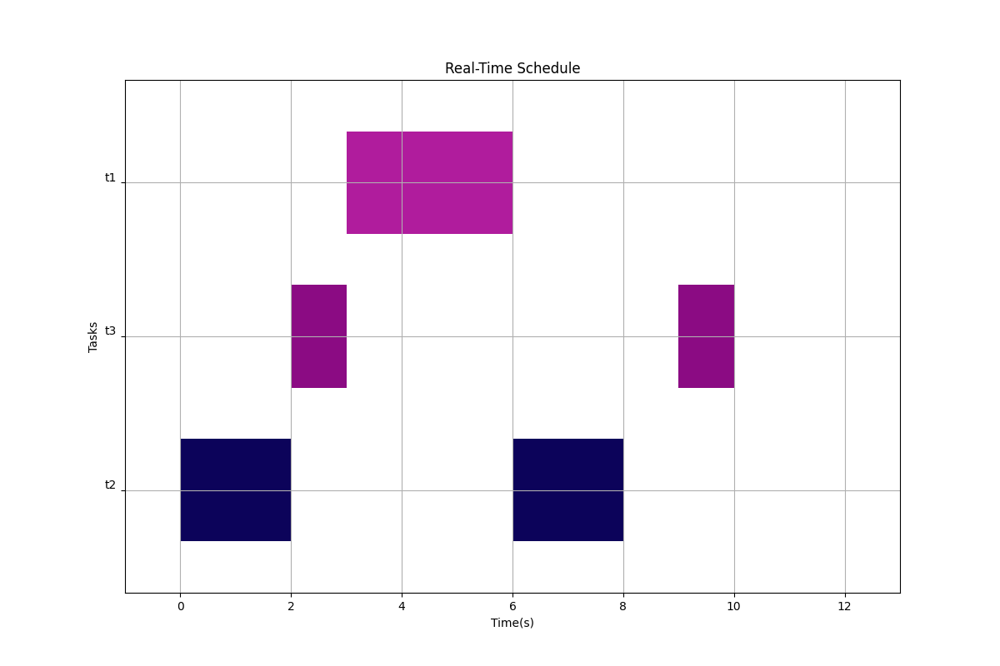

[![Say Thanks][saythanks-shield]][saythanks-url]
[![Contributors][contributors-shield]][contributors-url]
[![Forks][forks-shield]][forks-url]
[![Stargazers][stars-shield]][stars-url]
[![Issues][issues-shield]][issues-url]
[](http://hits.dwyl.com/guilyx/realtime-scheduler)
[![MIT License][license-shield]][license-url]
[![LinkedIn][linkedin-shield]][linkedin-url]

# Real-Time Scheduler

A C++ implementation of a scheduling simulator

## Overview


<p align="center">
    <!--- relative path means image/image.png instead of https://etc... -->
                               
</a>

This scheduling simulator is as of now capable of computing schedulability, feasibility of Rate Monotonic Scheduler, as well as compute the schedule and plot it as a Gantt Chart.

```
├── CMakeLists.txt
├── data
│   ├── hello
│   └── rms_test_toto
├── include
│   ├── Helpers.h
│   ├── RateMonotonic.h
│   ├── Simulator.h
│   ├── Task.h
│   └── TaskSet.h
├── LICENSE
├── README.md
└── src
    ├── gantt.py
    ├── main.cpp
    ├── RateMonotonic.cpp
    ├── Simulator.cpp
    ├── Task.cpp
    └── TaskSet.cpp
```

## Architecture

```cpp
class TaskSet {
    public:
        TaskSet();
        void register_task(Task tsk);
        void remove_task(const char* task_id);
        std::map<const char*, Task> get_task_set() const;
        void print_task_set();
        void schedule(int scheduler);
        int get_number_of_tasks() const;
        std::vector<const char*> get_time_table() const;
        void print_schedule() const;
    private:
        std::map<const char*, Task> m_tasks;
        std::vector<const char*> m_time_table;
        std::vector<Task> m_priority_vector;
        int m_number_of_tasks = 0;
        int m_hyper_period;
        void compute_priorities(int scheduler);
        void compute_time_table();
        bool compute_sufficient_condition(int scheduler);
        void compute_hyper_period();
};
```

A Task has specifications such as offset, computation time, period and deadline. 
A Task can be registered or removed from a Task Set, which can compute its feasibility/schedulability and the schedule resulted from the chosen Scheduling Algorithm.

## Run

Always run from the root of the project.

1. Build the project : 
```
$ mkdir build
$ cd build/ 
$ cmake ..
$ make
$ cd ..
```

2. Run the project : `./build/rt_sched "filename"`

3. Python script documentation :

```
$ python src/gantt.py --help
usage: gantt.py [-h] [--filename FILENAME]

Real-Time tasks Gantt plotter from data file

optional arguments:
  -h, --help           show this help message and exit
  --filename FILENAME  Register the path to the schedule description file
```


## Contribute

Contributions are what make the open source community such an amazing place to learn, inspire, and create. Any contributions you make are **greatly appreciated**. (please help)

### Contribute on proposed features

1. Choose any open issue from [here](https://github.com/guilyx/realtime-scheduler/issues). 
2. Comment on the issue: `Can I work on this?` and get assigned.
3. Make changes to your `Fork` and send a PR.

Otherwise just create the issue yourself, and we'll discuss and assign you to it if serves the project !

To create a PR:

Follow the given link to make a successful and valid PR: https://help.github.com/articles/creating-a-pull-request/

To send a PR, follow these rules carefully, **otherwise your PR will be closed**:

1. Make PR title in this formats: 
```
Fixes #IssueNo : Name of Issue
``` 
```
Feature #IssueNo : Name of Issue
```
```
Enhancement #IssueNo : Name of Issue
```

According to what type of issue you believe it is.

For any doubts related to the issues, i.e., to understand the issue better etc, comment down your queries on the respective issue.

## License

Distributed under the MIT License. See `LICENSE` for more information.

## Contact

Erwin Lejeune - [@spida_rwin](https://twitter.com/spida_rwin) - erwin.lejeune15@gmail.com

## Contributors

- [Erwin Lejeune](https://github.com/Guilyx)

[saythanks-shield]:https://img.shields.io/badge/Say%20Thanks-!-1EAEDB.svg?style=flat_square
[saythanks-url]:https://saythanks.io/to/erwin.lejeune15%40gmail.com
[contributors-shield]: https://img.shields.io/github/contributors/guilyx/realtime-scheduler.svg?style=flat-square
[contributors-url]: https://github.com/guilyx/realtime-scheduler/graphs/contributors
[forks-shield]: https://img.shields.io/github/forks/guilyx/realtime-scheduler.svg?style=flat-square
[forks-url]: https://github.com/guilyx/realtime-scheduler/network/members
[stars-shield]: https://img.shields.io/github/stars/guilyx/realtime-scheduler.svg?style=flat-square
[stars-url]: https://github.com/guilyx/realtime-scheduler/stargazers
[issues-shield]: https://img.shields.io/github/issues/guilyx/realtime-scheduler.svg?style=flat-square
[issues-url]: https://github.com/guilyx/realtime-scheduler/issues
[license-shield]: https://img.shields.io/github/license/guilyx/realtime-scheduler.svg?style=flat-square
[license-url]: https://github.com/guilyx/realtime-scheduler/blob/master/LICENSE.md
[linkedin-shield]: https://img.shields.io/badge/-LinkedIn-black.svg?style=flat-square&logo=linkedin&colorB=555
[linkedin-url]: https://linkedin.com/in/erwinlejeune-lkn
